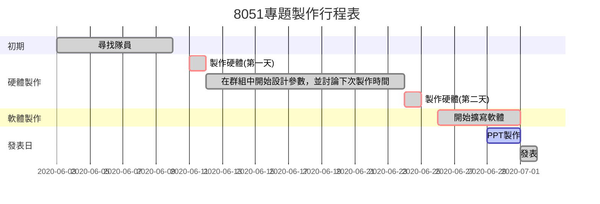

```mermaid
%% 语法示例
        gantt
        dateFormat  YY-MM-DD
        title 8051專題製作行程表
        
        section 初期 
        
        尋找隊員    						: done, des1 ,20-06-03 ,7d

        section 硬體製作
        製作硬體(第一天)                      :crit, done,des1,20-06-11,1d
        在群組中開始設計參數，並討論下次製作時間  :done,20-06-12,20-06-24
        製作硬體(第二天)                      :crit, done,20-06-24,1d
        
        section 軟體製作
        開始擴寫軟體                          :crit,done, 20-06-26, 20-07-01
        
        section 發表日
        PPT製作		                       :active , des1 ,20-06-29 ,20-07-01
        發表                              :done, des2, 20-07-01, 1d

```

8051腳位|P